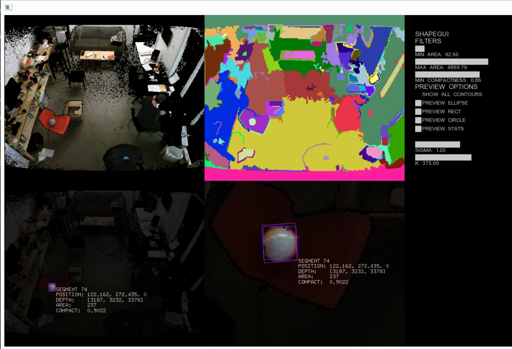

OpenCVKinectShapeTracker
========================

## What does this do do?

This example shows how to detect sphere like objects from the Kinect using a series of OpenCV steps

1. Open a Kinect 2 color and depth stream
1. Map the color information onto the depth information
1. Segment the color frame using EGS image segmentation algorithm and ofxImageSegmentation
1. Run contour tracking to determine geometric properties of each segment
1. Filter out small, oversides, and oddly shaped segments
1. Sense depth positions of the valid segments to find their 3D positions in space

## How do I get it to work?

NOTE: this example is currently Windows only becaue of Kinect Common Bridge dependency.

1. Download [openFrameworks 0.8.4 for VS2012](http://openframeworks.cc/download/)
2. Clone this repository into apps/myApps
3. Clone the following addons into addons/
  1. [ofxKinectV2](https://github.com/obviousjim/ofxKinectV2)
  2. [ofxUI](https://github.com/obviousjim/ofxUI)
  3. [ofxCv](https://github.com/obviousjim/ofxCv)
  4. [ofxImageSegmentation](https://github.com/obviousjim/ofxImageSegmentation)
4. Opent the .sln file and build and go

### Credits
This example was created by (James George)[http://jamesgeorge.org] for the [Curio Aquarium](http://curioaquarium.co) project, with financial support and encouragement from the Kinect For Windows team. 

ofxUI is originally by Reza Ali; ofxCv by Kyle McDonald; ofxImageSegmentation by James George based on [this example](http://cs.brown.edu/~pff/segment/)

